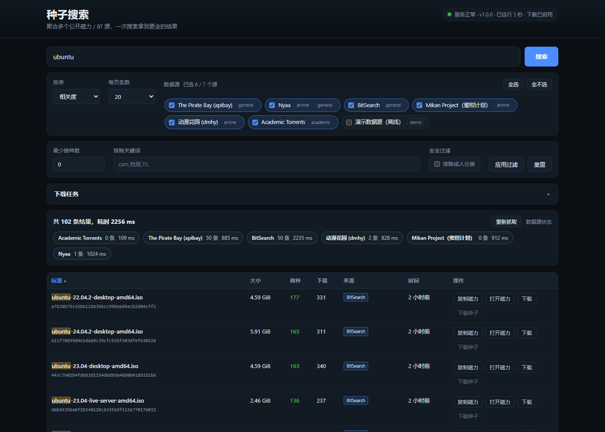
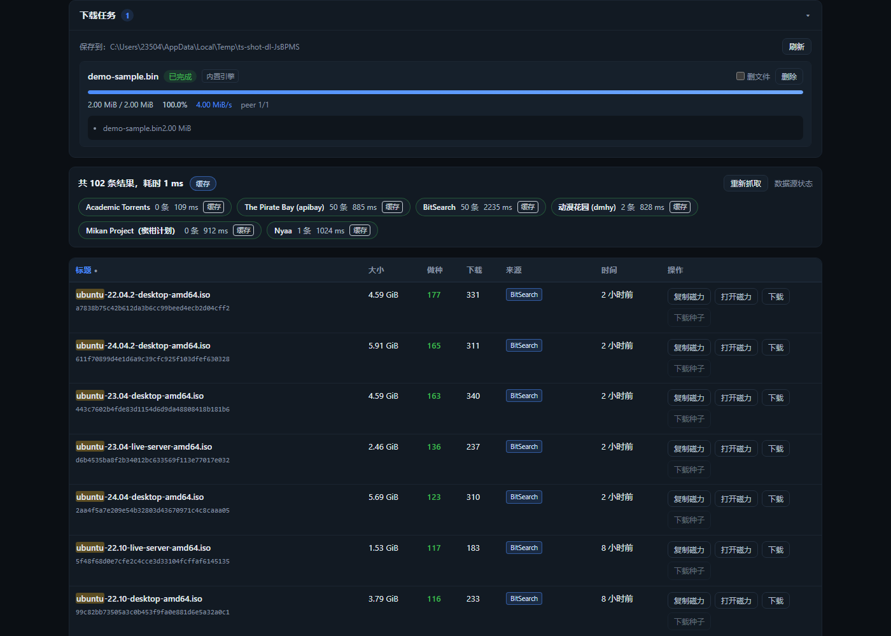

# 种子搜索

聚合多个公开磁力/BT 索引站的**本地搜索工具**：命令行、Web UI、JSON API 三种用法，**零运行时依赖**（只用 Node 内置模块）。

**中文** | [English](README.en.md)

```bash
node bin/magnet-search.mjs "ubuntu 24.04"
node bin/magnet-search.mjs serve          # 然后打开 http://127.0.0.1:8787
```



---

## 特性

- **多源聚合**：一次查询并发打 6 个公开源，结果合并去重（同一个种子跨站只出现一次，并标注全部来源）。
- **容错透明**：某个源超时/被墙/改版，不影响其它源；每个源的条数、耗时、失败原因都会展示出来。
- **结果过滤**：最少做种数、排除关键词（`cam`/`枪版`/`TS`）、安全过滤（排除站点标注的成人分类）。
- **排序可控**：相关度 / 做种数 / 下载数 / 大小 / 时间，五个维度都支持升降序，作用于完整候选池（不是当前页内重排）。
- **中文友好**：支持中文关键词（如「进击的巨人」），终端表格按东亚字符宽度对齐不会错位。
- **零依赖**：不需要 `npm install`，不需要构建步骤，Node ≥ 20 直接跑。
- **代理支持**：`--proxy 127.0.0.1:7897` 或 `--proxy auto`（自动读系统代理，Windows 下会读注册表）。
- **三种用法**：CLI（可管道/可脚本化）、Web UI（可视化）、JSON API（可被其它程序调用）。
- **可验证**：232 个离线单元测试（真实响应夹具）+ 实网冒烟测试 + 项目自检（`npm run lint`）。

---

## 快速开始

环境要求：Node.js ≥ 20（开发验证于 Node 26.8.1）。

```bash
# 1) 聚合搜索
node bin/magnet-search.mjs "ubuntu server"

# 2) 只看磁力链接（方便管道）
node bin/magnet-search.mjs "the last of us" --magnet

# 3) 指定中文源并排序
node bin/magnet-search.mjs "进击的巨人" --sources mikan,dmhy --sort seeders -n 30

# 4) 启动 Web UI + API
node bin/magnet-search.mjs serve --port 8787
```

输出示例：

```
搜索 「进击的巨人」  第 1/20 页  共 59 条（去重后）  用时 1467ms

#    标题                                                            体积       做种    下载  来源              时间
──────────────────────────────────────────────────────────────────────────────────────────────────────────────────
1    [7³ACG] 剧场版「进击的巨人」完结篇THE LAST ATTACK/Shingeki no…   6.00 GiB      -       -  dmhy+mikan        1 个月前
2    [7³ACG] 剧场版「进击的巨人」完结篇THE LAST ATTACK/Shingeki no…   3.60 GiB      -       -  dmhy+mikan        1 个月前
3    [VCB-Studio] 进击的巨人 / Shingeki no Kyojin / 進撃の巨人 10-bi… 110.50 GiB     -       -  dmhy+mikan        5 个月前

数据源：dmhy ✓ 50 条 1242ms  ·  mikan ✓ 50 条 1465ms
```

---

## 命令行

```
magnet-search <关键词> [选项]     聚合搜索
magnet-search serve [选项]        启动本地 Web UI + JSON API（默认 127.0.0.1:8787）
magnet-search sources             列出所有数据源
magnet-search check [关键词]      逐源连通性自检（排查「哪个源挂了」）
magnet-search doctor              诊断 P2P 下载环境（下载失败先跑这个）
magnet-search download <目标>     下载磁力链接 / info hash（内置 BT 引擎，零依赖）
magnet-search downloads           查看下载任务记录
```

### 下载失败？先跑 doctor

```powershell
node bin\magnet-search.mjs doctor
```

它会逐项检查并给出**可执行的结论**：代理 TUN 虚拟网卡、tracker 通告（HTTP）、DHT（UDP）、
真实 peer 的 BT 握手。例如在 Clash TUN 环境下的输出：

```
  ⚠ 代理 TUN 虚拟网卡  网卡「Meta」疑似代理 TUN 虚拟网卡
  ✓ tracker 通告        拿到 50 个 peer（此步走 HTTP，可经代理）
  ⚠ DHT（UDP）          网络可达但没有查到 peer（UDP 可能被拦截）
  ✗ peer BT 握手        0 个成功（5 个被对端关闭）

结论
  P2P 流量正在被代理拦截（TUN 模式接管了全局路由）。
  修复：在 Clash 中把模式从 TUN 切换为「系统代理」，或暂时关闭 TUN/系统代理后重试；
  也可以在代理规则里把 BT 流量（TCP 高位端口与 UDP）设为 DIRECT。
```

下载失败时引擎也会自动附上同类诊断（失败模式归纳 + 检测到的 TUN 网卡 + 建议）。

### 用 qBittorrent 下载（受限网络推荐）

如果你的网络像上面那样拦截 P2P，内置引擎（明文握手）下不动，但 **qBittorrent 自带协议加密（MSE）**，
很多环境下能绕过 DPI。工具内置了桥接层：把任务交给本机 qBittorrent 执行，搜索工具负责跟踪进度与取消。

```powershell
# 1. 安装并启动 qBittorrent（已装可跳过）
winget install qBittorrent.qBittorrent

# 2. 开启 Web UI：qBittorrent → 工具 → 选项 → Web UI
#    勾选「Web 用户界面」，设置用户名/密码（端口默认 8080）

# 3. 让工具连上它（可选，默认 http://127.0.0.1:8080）
$env:TORRENT_SEARCH_QBITTORRENT = "http://127.0.0.1:8080|admin|你的密码"

# 4. 下载（--backend auto 是默认值：qBittorrent 可用就交给它）
node bin\magnet-search.mjs download "magnet:?xt=urn:btih:..." --backend auto
node bin\magnet-search.mjs download "ubuntu 24.04" --pick 1 --backend qbittorrent
node bin\magnet-search.mjs doctor        # 会告诉你 qBittorrent 桥接是否可用
```

| 后端选项 | 说明 |
| --- | --- |
| `--backend auto` | **默认**。探测到 qBittorrent 可用就交给它，否则用内置引擎 |
| `--backend builtin` | 只用内置引擎（零依赖，明文握手） |
| `--backend qbittorrent` | 只用 qBittorrent（不可用时任务直接失败并说明原因） |
| `--qb-url <地址>` | 覆盖连接地址：`http://127.0.0.1:8080\|用户名\|密码` |

任务列表里会标明每条任务由哪个后端执行（Web UI 的任务行上有「内置引擎 / qBittorrent」小标签，
`downloads` 命令也会显示），取消会通知 qBittorrent 移除任务（保留文件），删除则按你的选择决定是否删文件。

> 实测提醒：在本机（Clash TUN + 机场）环境里，qBittorrent **同样**拿不到 peer——
> 机场在协议层丢弃了所有 BT 流量，协议加密也无法幸免。
> **根治方法只有一条：让 BT 流量直连**（Clash 规则里把 BT 相关流量设为 DIRECT，或换不限制 P2P 的网络）。
> 配置好后，内置引擎与 qBittorrent 桥接都能正常工作。

| 选项 | 说明 |
| --- | --- |
| `-s, --sources <列表>` | 数据源，逗号分隔；`default`=默认源、`all`=全部；如 `apibay,nyaa` |
| `--sort <方式>` | `relevance`（默认）/ `seeders` / `leechers` / `size` / `date` |
| `--order <方向>` | `desc`（默认，从大到小/最新在前）/ `asc` |
| `-n, --page-size <N>` | 每页条数（默认 20，最大 100） |
| `--page <N>` | 页码，从 1 开始 |
| `--min-seeders <N>` | 只保留做种数 ≥ N 的结果（做种数未知的会被过滤掉） |
| `--exclude <词>` | 排除关键词，逗号分隔；如 `--exclude cam,枪版,TS` |
| `--safe` | 安全过滤：排除站点标注为成人分类的结果 |
| `--json` | 输出完整 JSON（含每源状态），便于脚本处理 |
| `--magnet` | 只输出磁力链接，每行一条 |
| `--timeout <ms>` | 单个数据源超时（默认 8000） |
| `--proxy <地址>` | HTTP 代理，如 `127.0.0.1:7897`；`auto` = 自动探测系统代理 |
| `--demo` | 只用内置离线演示源（不需要联网，用于验证安装） |
| `--open` | （`serve`）启动后自动打开浏览器 |
| `--no-color` / `-v` | 关闭彩色 / 打印调试日志 |

过滤示例：

```bash
# 只要做种数 ≥ 20 的，并且排除枪版/TS
node bin/magnet-search.mjs "流浪地球" --min-seeders 20 --exclude 枪版,TS,cam

# 安全过滤 + 按下载数升序（找冷门资源）
node bin/magnet-search.mjs ubuntu --safe --sort leechers --order asc
```

**退出码**：`0` 成功（包括「没有结果」）、`1` 运行出错或**全部**数据源失败、`2` 参数错误。

### 下载

内置了一个**零依赖的最小 BT 引擎**（Tracker HTTP/UDP、Peer 协议、BEP 9 元数据交换、
分片下载与 SHA1 校验），可以直接把搜索结果下载到本地：

```bash
# 直接给磁力链接
node bin/magnet-search.mjs download "magnet:?xt=urn:btih:...&dn=..."

# 给 info hash（40 位 hex 或 32 位 Base32）
node bin/magnet-search.mjs download 2c6b6858d61da9543d4231a71db4b1c9264b0685

# 先搜索，取第 1 条结果下载
node bin/magnet-search.mjs download "ubuntu 24.04" --pick 1

# 限制大小（达到上限即停）、指定目录、不补充公共 tracker
node bin/magnet-search.mjs download "magnet:?..." --max-size 500 --dir D:\dl --no-extra-trackers
```

| 下载选项 | 说明 |
| --- | --- |
| `--pick <N>` | 先用关键词搜索，取第 N 条结果的磁力（1 开始） |
| `--dir <目录>` | 保存目录，默认 `~/Downloads/torrent-search` |
| `--max-size <MiB>` | 大小上限，达到即停（防误下），下载结果标记 `stopped` |
| `--no-extra-trackers` | 只信磁力自带的 tracker，不补充公共 tracker（减少暴露） |
| `--no-dht` | 不做 DHT 回退：tracker 失败就直接放弃（更快，但少一条通路） |
| `--limit-speed <速率>` | 限速，如 `2M` / `500K` / `1048576`（默认不限） |
| `--backend <名称>` | `auto`(默认) / `builtin` / `qbittorrent`，见上文「用 qBittorrent 下载」 |
| `--qb-url <地址>` | qBittorrent WebUI 地址（`http://127.0.0.1:8080\|用户名\|密码`） |

Web UI 里每条结果都有「下载」按钮，页面下方有下载面板（进度条 / 速度 / peer 数 / 取消 / 删除），
实时进度走 SSE（`GET /api/downloads/stream`）。



**引擎的能力边界（实话实说）：**

- ✅ 支持：磁力解析、HTTP(S)/UDP tracker、**DHT（BEP 5 get_peers 迭代查找，作为 tracker 的回退通路）**、
  元数据交换（BEP 9）、多文件种子、分片 SHA1 校验、断点续传（重新添加同一磁力会先校验已有分片）、大小上限安全阀。

- ❌ 不实现：**DHT announce_peer 与 PEX**、上传做种、加密传输、uTP。因此：
  - 找 peer 的顺序是「磁力自带 tracker → 补充的公共 tracker → DHT 回退」，三者都失败才报错（不会静默卡住）；
  - **DHT 走 UDP，无法经过 HTTP 代理**——代理环境下 DHT 会失败，所以它是"尽力而为的补充"，
    不能当唯一通路；不想等它可用 `--no-dht` 跳过；
  - 下载速度取决于 peer 数量，通常不如 qBittorrent/aria2 这类成熟客户端；
  - 大文件建议用成熟的 BT 客户端，本功能适合小文件与"搜到即下"的场景。

---

## Web UI

```bash
node bin/magnet-search.mjs serve            # 默认 http://127.0.0.1:8787
node bin/magnet-search.mjs serve --port 9000 --proxy auto
```

界面功能：关键词搜索、数据源多选（记忆偏好）、表头点击排序（升降序）、结果过滤（最少做种数 / 排除关键词 / 安全过滤）、
分页、每源状态条（失败原因悬停可见）、关键词高亮、一键复制磁力 / 打开磁力 / 下载 .torrent、
「重新抓取」绕过服务端缓存、窄屏自适应。只监听本机回环地址，不对外暴露。

---

## JSON API

### `GET /api/search`

| 参数 | 必填 | 说明 |
| --- | --- | --- |
| `q` | ✅ | 关键词（最长 200 字符） |
| `sources` | | 逗号分隔的源 id；不传 = 默认源 |
| `sort` | | `relevance`(默认) / `seeders` / `leechers` / `size` / `date` |
| `order` | | `desc`(默认) / `asc` |
| `page` / `pageSize` | | 默认 1 / 20，`pageSize` 上限 100 |
| `minSeeders` | | 只保留做种数 ≥ 该值；做种数未知的结果会被过滤 |
| `exclude` | | 排除关键词，逗号分隔（最多 20 个）；ASCII 词按词首边界匹配，中文按子串 |
| `safe` | | `1` = 排除站点标注为成人分类的结果 |
| `noCache` | | `1` = 跳过服务端 60 秒结果缓存，强制重新抓取 |
| `timeoutMs` | | 单源超时，默认 8000 |

```jsonc
{
  "query": "ubuntu",
  "sort": "relevance",
  "order": "desc",
  "tookMs": 1234,
  "page": 1, "pageSize": 20,
  "total": 41,              // 过滤之后的条数
  "totalBeforeFilter": 102, // 过滤之前（去重后）的条数
  "totalPages": 3,
  "cached": false,          // 是否命中服务端缓存
  "filters": { "minSeeders": 10, "exclude": ["cam"], "safe": true },
  "results": [
    {
      "id": "apibay:2c6b6858d61da9543d4231a71db4b1c9264b0685",
      "title": "Ubuntu 22.04 LTS",
      "infoHash": "2c6b6858d61da9543d4231a71db4b1c9264b0685",
      "magnet": "magnet:?xt=urn:btih:2c6b6858d61da9543d4231a71db4b1c9264b0685&dn=Ubuntu%2022.04%20LTS",
      "size": 3654957056, "sizeText": "3.40 GiB",
      "seeders": 31, "leechers": 1,
      "category": "软件",
      "adult": false,
      "publishedAt": "2022-05-18T14:33:51.000Z",
      "source": "apibay", "sourceName": "The Pirate Bay (apibay)",
      "detailsUrl": "https://thepiratebay.org/description.php?id=59191690",
      "torrentUrl": "https://apibay.org/torrent/59191690",
      "score": 42.7,
      "sources": ["apibay", "bitsearch"]
    }
  ],
  "sources": [
    { "id": "apibay", "name": "The Pirate Bay (apibay)", "ok": true, "count": 100, "tookMs": 420, "error": null, "cached": false },
    { "id": "nyaa", "name": "Nyaa", "ok": false, "count": 0, "tookMs": 8000, "error": "超时 (8000ms)", "cached": false }
  ]
}
```

> 站点不提供的字段一律为 `null`（例如 dmhy 没有体积与做种数），**不会**用 `0` 冒充。
> `adult` 只依据站点自己的分类标注（apibay 5xx、BitSearch 10），不猜标题关键词。

### 其它接口

- `GET /api/sources` — 数据源列表（id、名称、说明、是否默认启用）
- `GET /api/health` — `{ok, version, uptimeSec, node, proxy, downloads:{enabled, dir, active}}`
- 下载任务（需要 serve 启用）：
  - `POST /api/downloads` — body `{"input":"磁力或hash","dir"?,"name"?,"backend"?}` → 201 任务快照
  - `GET /api/downloads` — 任务列表（含 `dir`、`backend`、`qbit:{ok,version}`）
  - `GET /api/downloads/:id` — 单个任务；`DELETE /api/downloads/:id?deleteFiles=1` — 取消并删除
  - `GET /api/downloads/stream` — SSE 实时进度
- 错误统一为 `{"error":{"code":"bad_request","message":"..."}}`

### 作为库使用

```js
import { createContext, searchAll } from './src/index.mjs';

const ctx = await createContext({ proxy: 'auto' });
const { results, sources } = await searchAll({ query: 'blender', sort: 'seeders', ...ctx });
console.log(results[0].magnet, sources);
```

---

## 数据源

| id | 站点 | 类型 | 默认 | 说明 |
| --- | --- | --- | --- | --- |
| `apibay` | The Pirate Bay | 综合 | ✅ | 官方 JSON 接口，一次最多 100 条 |
| `nyaa` | Nyaa | 动漫/综合 | ✅ | RSS 接口，含分类与做种数 |
| `bitsearch` | BitSearch | 综合 | ✅ | DHT 爬虫索引，JSON 接口，覆盖面广 |
| `mikan` | Mikan Project（蜜柑计划） | 中文动漫 | ✅ | RSS 搜索，Episode 编号即 info hash |
| `dmhy` | 动漫花园 | 中文动漫 | ✅ | RSS 搜索，磁力是 Base32（已归一化） |
| `academic` | Academic Torrents | 学术 | ✅ | 无搜索接口，全量库（约 3 MB）缓存到本地后检索 |
| `demo` | 内置离线数据 | 演示 | ❌ | 10 条固定数据，断网也能演示/自测 |

新增数据源只需实现一个 `search(query, ctx)` 并注册到 `src/sources/index.mjs`（约 60 行）。

---

## 代理

```bash
node bin/magnet-search.mjs "ubuntu" --proxy 127.0.0.1:7897   # 指定
node bin/magnet-search.mjs "ubuntu" --proxy auto             # 自动探测（环境变量 → Windows 注册表）
```

实现方式：直连走 Node 内置 `fetch`；走代理时自行建立 HTTP `CONNECT` 隧道 + TLS
（因为 Node 的内置 fetch 只在进程启动时读代理环境变量，无法在运行时切换）。

---

## Docker 部署

```bash
docker compose up -d --build        # 构建并启动，访问 http://127.0.0.1:8787/
docker compose exec torrent-search node bin/magnet-search.mjs doctor   # 容器内诊断
docker compose down
```

下载文件落在 `./downloads`（compose 里挂的卷），环境变量可覆盖一切：

| 环境变量 | 默认（本机 / 容器） | 说明 |
| --- | --- | --- |
| `TORRENT_SEARCH_HOST` | `127.0.0.1` / `0.0.0.0` | 监听地址。容器里必须 `0.0.0.0`，否则端口映射进不来 |
| `TORRENT_SEARCH_PORT` | `8787` | 监听端口 |
| `TORRENT_SEARCH_DOWNLOAD_DIR` | `~/Downloads/torrent-search` / `/downloads` | 下载目录 |
| `TORRENT_SEARCH_BACKEND` | `auto` | `auto` / `builtin` / `qbittorrent` |
| `TORRENT_SEARCH_QBITTORRENT` | `127.0.0.1:8080` / `host.docker.internal:8080` | qBittorrent WebUI 地址 |
| `TORRENT_SEARCH_CACHE` | 用户缓存目录 | 磁盘缓存（academic 全量索引） |

### 容器化的三个实话

**1. Docker 绕不过你的封锁。** Windows 上的 Docker Desktop 跑在 WSL2 虚拟机里，容器流量最终还是
经宿主机的网络栈出去——**Clash TUN 照样能接管**（Clash Verge 的 TUN 模式通常连 WSL 流量一起抓）。
而且拦截发生在机场出口，跟客户端跑在哪里无关。所以「换个环境跑」不解决问题。

**2. 会多出几个必须处理的点**（上面的镜像与代码已经处理好）：文件要挂卷、必须绑 `0.0.0.0`、
qBittorrent 要用 `host.docker.internal`、容器里 `doctor` 看不到宿主机的 TUN（会明确告诉你"去宿主机排查"）。

**3. 收益主要在两个场景**：

- **部署到 Linux NAS / 家庭服务器常驻**——这是 Docker 的主场，跨设备访问 Web UI；
- **配合 VPN 容器让 BT 走独立出口**——这才是容器化真正能解决 P2P 被拦的用法。
  见 `docker-compose.yml` 末尾的注释示例（`network_mode: service:gluetun`）：
  容器流量全部从 VPN 出去，不受宿主机 Clash TUN 影响，而 VPN 通常不拦 P2P。

> 反过来说：如果你的目标只是"在 Windows 本机上能下载"，**本机直接跑 Node 更简单**——
> 这项目零依赖，`node bin/magnet-search.mjs serve` 就完事，Docker 只会多一层麻烦。
> 真正要修的是让 BT 流量直连（Clash 规则或 VPN 出口）。

---

## 测试

```bash
npm test           # 232 个离线单元测试：解析、聚合、过滤、缓存、HTTP、服务、BT 引擎、下载管理
npm run lint       # 项目自检：全量语法检查 + 零依赖/无 XSS API/适配器契约等约定检查
npm run smoke      # 实网冒烟：对每个在线源发真实请求并校验字段自洽性
npm run fixtures   # 重新抓取测试夹具（站点改版后跑一次）
npm run check      # 逐源连通性自检
npm run screenshots # 重新生成 README 里的 Web UI 截图（用无头 Edge/Chrome，零依赖）
```

测试分层：纯函数 → 解析层（真实夹具）→ 聚合层（注入假源，覆盖过滤/缓存/排序）→ 网络层（本机 HTTP + 自建 CONNECT 代理）
→ BT 引擎（**本地假种子群**：自实现的 tracker + 做种 peer，端到端验证磁力→元数据→分片→校验→落盘）
→ 服务层（真实 HTTP 服务，覆盖参数校验与错误码）→ 实网冒烟（唯一联网的一层）。
CI（`.github/workflows/ci.yml`）在 Ubuntu 与 Windows 上跑 Node 20/22/24 的单元测试，实网冒烟单独作为非阻塞任务。

---

## 项目结构

```
bin/magnet-search.mjs   CLI 入口（搜索 + 下载）
src/
  ├── aggregate / server / http / cache / models / magnet / size / format / xml / rss / categories
  ├── bt/               最小 BT 引擎（bencode、tracker、peer、torrent、storage、engine）
  └── download/         任务管理器（排队、并发、进度事件、持久化）
web/                    Web UI（原生 HTML/CSS/JS，无构建，含下载面板）
test/                   离线测试 + 真实响应夹具 + 本地假种子群
tools/                  夹具抓取、实网冒烟、项目自检（lint）、截图生成
docs/需求与架构设计.md   需求、数据源调研、架构与设计决策
docs/screenshot-*.png   README 用的 Web UI 截图（npm run screenshots 重新生成）
.github/workflows/      CI
```

---

## 免责声明

本工具只聚合**公开索引站点**上已经公开的元数据（标题、体积、info hash 等），
不托管、不缓存、不分发任何受版权保护的内容。内置的下载功能是标准 BitTorrent 客户端能力，
本工具自身不提供、不索引任何内容资源。请遵守你所在地区的法律法规以及各站点的服务条款，
仅将本工具用于你有权获取的内容（如开源软件发行版、CC 授权作品等）。
